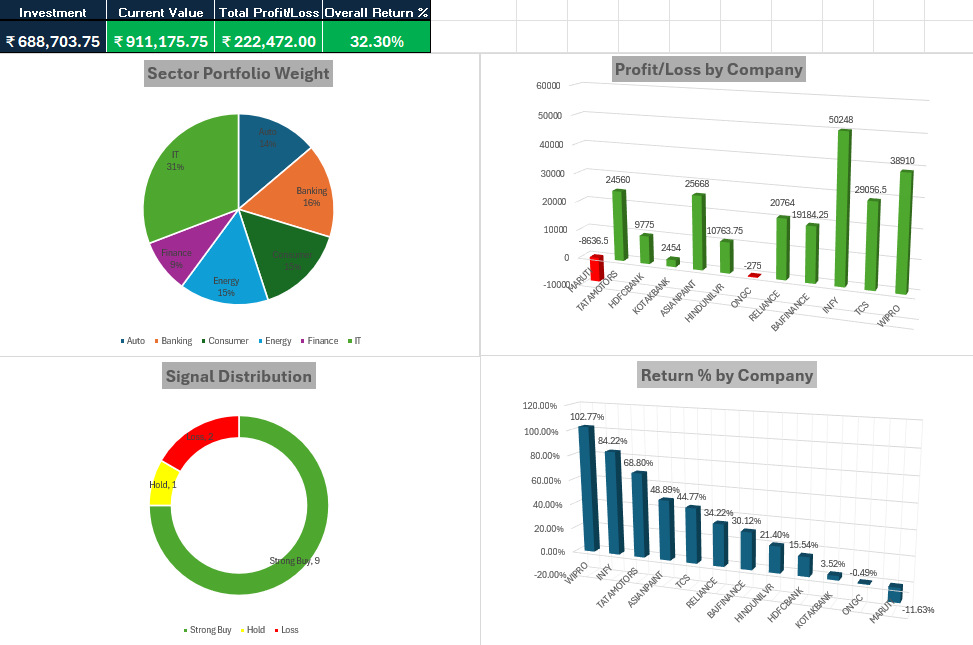
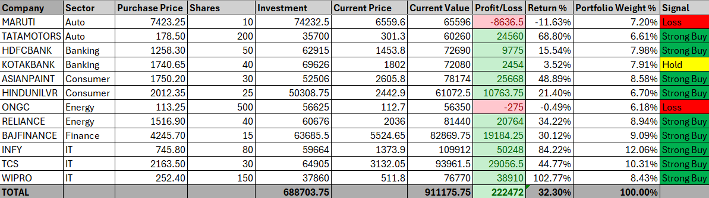
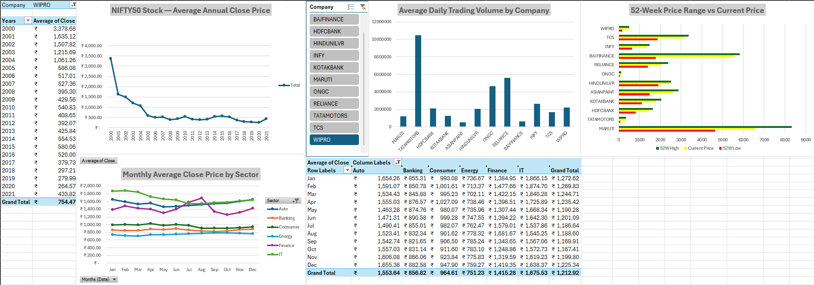
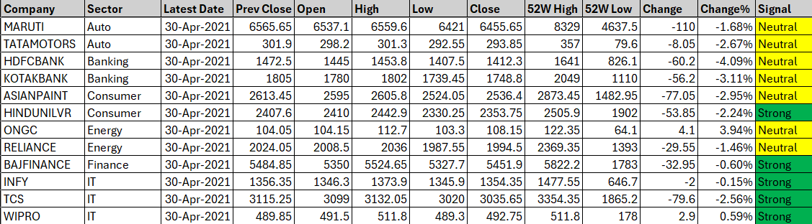

# NIFTY50-Stock-Portfolio-Analysis
An Excel-based NIFTY50 stock portfolio analyser covering 12 companies, 62000+ rows, and 21 years of trading data (2000-2021)
## Project Overview

This project was built to demonstrate advanced Excel skills including 
data modelling, formula-driven automation, PivotTables, and interactive 
dashboard design, using real NIFTY50 stock market data.

## Key Findings

- Overall portfolio return: 32.30% (Investment 6.88L grew to 9.11L)
- Highest return: WIPRO at 102.77%
- Strongest IT performers: INFY at 84.22%, TCS at 44.77%
- Only 2 out of 12 stocks in loss: MARUTI -11.63%, ONGC -0.49%
- IT sector had the highest average monthly close price at 1,675
- Energy sector had the lowest at 751
- Signal distribution: 9 Strong Buy, 1 Hold, 2 Loss

## Workbook Structure

| Sheet | Description |
|-------|-------------|
| Raw Data | Merged dataset of 12 company CSVs, 62,000+ rows, 21 years |
| Stock Data | Latest snapshot with 52W High/Low, Change%, and Signal |
| Portfolio | Dynamic tracker with XLOOKUP, Profit/Loss, Return%, Weight% |
| Dashboard | KPI cards and 4 interactive charts |
| Trends | PivotTable charts with company slicer and sector analysis |

## Excel Skills Demonstrated

- XLOOKUP, SUMIF, AVERAGEIF, COUNTIF, INDEX, LARGE, IFERROR
- PivotTables and PivotCharts with date grouping
- Interactive slicers for company and sector filtering
- Conditional formatting for signal and profit/loss logic
- Star Schema style multi-sheet data modelling
- KPI card design without merging cells
- Dynamic chart linking across sheets

## Dashboard Preview

## Data Source

Dataset sourced from Kaggle:
https://www.kaggle.com/datasets/rohanrao/nifty50-stock-market-data

Note: Raw CSV files are not included in this repository due to licensing. 
Please download directly from the Kaggle link above.

## Tools Used

- Microsoft Excel (Advanced)

## Author

Abhiram Chiyyarath Devanand
https://linkedin.com/in/abhiramcdev
